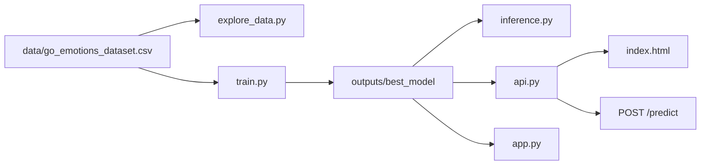

<div align="center">

# 🎭 EmoSense - Emotion Detection Model


</div>

## Overview

Emotion Detection is a Machine Learning NLP project that predicts one or more emotions from text. It uses a fine-tuned `bert-base-uncased` model for multi-label classification over the 28-label GoEmotions taxonomy.

The project is useful when you need to:

- Analyze emotional tone in short text such as comments, reviews, messages, or support tickets.
- Run local model inference from the command line.
- Expose emotion prediction through a REST API.
- Serve a lightweight browser interface for demos.
- Re-train or adapt the model on a GoEmotions-style CSV dataset.
- Explore label distribution and emotion co-occurrence before training.

The repository includes a trained model in [outputs/best_model](outputs/best_model), so you can run predictions immediately after installing dependencies.

## Table of Contents

- [Overview](#overview)
- [Features](#features)
- [Emotion Labels](#emotion-labels)
- [Architecture](#architecture)
- [Project Structure](#project-structure)
- [Requirements](#requirements)
- [Quick Start](#quick-start)
- [Usage](#usage)
- [API Reference](#api-reference)
- [Training](#training)
- [Dataset Exploration](#dataset-exploration)
- [Configuration](#configuration)
- [License](#license)

## Features

| Area | What it provides |
| --- | --- |
|  Model | Fine-tuned BERT sequence classifier using sigmoid multi-label outputs. |
|  Labels | 28 GoEmotions labels, including positive, negative, ambiguous, and neutral emotions. |
|  CLI | Batch-friendly command-line predictions with configurable threshold and top-N display. |
|  API | Flask `/predict` endpoint for app integration. |
|  Web UI | Static HTML interface served by the Flask app. |
|  EDA | Dataset plots for label distribution, text lengths, labels per example, and co-occurrence. |
|  Training | End-to-end fine-tuning script with train/validation/test splits and saved artifacts. |

## Emotion Labels

The classifier predicts these 28 emotions:

```text
admiration     amusement      anger          annoyance
approval       caring         confusion      curiosity
desire         disappointment disapproval    disgust
embarrassment  excitement     fear           gratitude
grief          joy            love           nervousness
optimism       pride          realization    relief
remorse        sadness        surprise       neutral
```

Predictions are multi-label. A single text can produce several emotions when their probabilities are above the selected threshold. If nothing crosses the threshold, the app returns the highest-scoring emotion as a fallback.

## Architecture



Main workflows:

1. Explore the dataset with [explore_data.py](explore_data.py).
2. Train or fine-tune BERT with [train.py](train.py).
3. Load the saved model from [outputs/best_model](outputs/best_model).
4. Run inference through the CLI, Flask API, static browser UI, or Streamlit demo.

## Project Structure

```text
.
|-- api.py                         # Flask API and static UI server
|-- app.py                         # Optional Streamlit demo
|-- explore_data.py                # EDA script for the GoEmotions CSV
|-- inference.py                   # CLI and reusable EmotionPredictor class
|-- train.py                       # BERT fine-tuning pipeline
|-- index.html                     # Browser UI for the Flask API
|-- requirements.txt               # Python dependencies
|-- data/
|   `-- go_emotions_dataset.csv    # One-hot GoEmotions-style dataset
|-- eda_outputs/
|   |-- summary_stats.json         # Dataset summary
|   |-- 01_label_distribution.png
|   |-- 02_text_lengths.png
|   |-- 03_labels_per_example.png
|   `-- 04_cooccurrence_heatmap.png
`-- outputs/
    `-- best_model/
        |-- config.json            # BERT model config and label mapping
        |-- model.safetensors      # Fine-tuned model weights
        |-- tokenizer.json
        `-- tokenizer_config.json
```

## Requirements

- Python 3.10 or newer
- pip
- CPU for inference
- CUDA-capable GPU recommended for training

Install dependencies from [requirements.txt](requirements.txt):

```bash
pip install -r requirements.txt
```

Core libraries:

| Library | Purpose |
| --- | --- |
| `torch` | Model training and inference |
| `transformers` | BERT tokenizer and sequence classifier |
| `flask`, `flask-cors` | REST API and browser UI serving |
| `pandas`, `numpy` | Dataset loading and preprocessing |
| `scikit-learn` | Train/validation/test split and metrics |
| `matplotlib`, `seaborn` | EDA visualizations |
| `tqdm` | Training progress bars |

## Quick Start

### 1. Create a Virtual Environment

```bash
python -m venv venv
```

Activate it:

```bash
# Windows PowerShell
.\venv\Scripts\Activate.ps1

# macOS/Linux
source venv/bin/activate
```

### 2. Install Dependencies

```bash
pip install -r requirements.txt
```

Optional Streamlit dependency:

```bash
pip install streamlit
```

### 3. Download the Dataset

The dataset is not included in this repository. Download the GoEmotions dataset from Kaggle:

[GoEmotions on Kaggle](https://www.kaggle.com/datasets/debarshichanda/goemotions)

After downloading and extracting it, place the CSV file at:

```text
data/go_emotions_dataset.csv
```

This is the default path used by [train.py](train.py) and [explore_data.py](explore_data.py). If your downloaded file has a different name, either rename it to `go_emotions_dataset.csv` or pass the path explicitly with `--csv`.

Optional Kaggle CLI example:

```bash
kaggle datasets download -d debarshichanda/goemotions -p data --unzip
```

### 4. Run a Prediction

```bash
python inference.py --model_dir ./outputs/best_model --text "I can't believe how amazing this is!"
```

### 5. Start the Web App

```bash
python api.py --model_dir ./outputs/best_model --port 5000
```

Open this URL in your browser:

```text
http://localhost:5000
```

## Usage

### CLI Inference

Run one text:

```bash
python inference.py \
  --model_dir ./outputs/best_model \
  --text "Thanks so much for your help. I really appreciate it."
```

Run multiple texts by separating them with `||`:

```bash
python inference.py \
  --text "Thank you so much!||I am really disappointed.||That was unexpected!" \
  --threshold 0.4 \
  --top_n 5
```

Useful CLI flags:

| Flag | Default | Description |
| --- | --- | --- |
| `--text` | Demo examples | Text to classify. Use `||` between multiple inputs. |
| `--model_dir` | `./outputs/best_model` | Directory containing the saved model and tokenizer. |
| `--threshold` | `0.5` | Probability cutoff for predicted labels. |
| `--top_n` | `5` | Number of highest scoring labels to print. |

### Flask API and Static UI

Start the Flask app:

```bash
python api.py --model_dir ./outputs/best_model --host 0.0.0.0 --port 5000
```

The app serves:

| Route | Method | Purpose |
| --- | --- | --- |
| `/` | `GET` | Serves [index.html](index.html). |
| `/health` | `GET` | Returns API and model-load status. |
| `/predict` | `POST` | Predicts emotions for text input. |

### Streamlit Demo

[app.py](app.py) provides an alternative Streamlit interface:

```bash
streamlit run app.py -- --model_dir ./outputs/best_model
```

Use this when you want a simple Python-native demo with a threshold slider and top-probability display.

## API Reference

### Health Check

```bash
curl http://localhost:5000/health
```

Example response:

```json
{
  "status": "ok",
  "model_loaded": true
}
```

### Predict Emotions

```bash
curl -X POST http://localhost:5000/predict \
  -H "Content-Type: application/json" \
  -d "{\"text\":\"Thanks for helping me today.\",\"threshold\":0.5}"
```

Request body:

| Field | Type | Required | Description |
| --- | --- | --- | --- |
| `text` | string | Yes | Input text to classify. Maximum length is 1,000 characters. |
| `threshold` | number | No | Probability cutoff. Defaults to `0.5`. |

Example response:

```json
{
  "text": "Thanks for helping me today.",
  "emotions": ["gratitude"],
  "scores": {
    "admiration": 0.1234,
    "gratitude": 0.8421,
    "neutral": 0.0312
  },
  "emoji": {
    "gratitude": "🙏"
  },
  "colors": {
    "gratitude": "#DAA520"
  }
}
```

The actual `scores` object contains all 28 labels.

Validation behavior:

- Missing `text` returns `400`.
- Empty text returns `400`.
- Text longer than 1,000 characters returns `400`.
- If no emotion is above `threshold`, the API returns the highest-scoring label.

## Training

[train.py](train.py) fine-tunes `bert-base-uncased` for multi-label classification.

The input CSV must include:

- `text`
- `example_very_unclear`
- one one-hot column for each of the 28 emotion labels

Start a training run:

```bash
python train.py \
  --csv data/go_emotions_dataset.csv \
  --epochs 3 \
  --batch_size 32 \
  --lr 2e-5 \
  --output_dir ./outputs
```

Training behavior:

- Removes rows where `example_very_unclear` is true.
- Removes rows with no active emotion label.
- Splits data into train, validation, and test sets.
- Uses `BCEWithLogitsLoss` for multi-label training.
- Tracks validation macro F1 and micro F1.
- Saves the best validation checkpoint to `outputs/best_model`.
- Writes training history and the final classification report to `outputs`.

Training outputs:

| Path | Description |
| --- | --- |
| `outputs/best_model/` | Best saved model and tokenizer. |
| `outputs/training_history.json` | Per-epoch train/validation metrics. |
| `outputs/test_classification_report.txt` | Final test-set classification report. |

## Dataset Exploration

Run EDA before training:

```bash
python explore_data.py --csv data/go_emotions_dataset.csv
```

Generated outputs:

| File | Description |
| --- | --- |
| [eda_outputs/summary_stats.json](eda_outputs/summary_stats.json) | Total rows, multi-label percentage, most common emotion, rarest emotion, neutral percentage. |
| [eda_outputs/01_label_distribution.png](eda_outputs/01_label_distribution.png) | Count of examples per emotion label. |
| [eda_outputs/02_text_lengths.png](eda_outputs/02_text_lengths.png) | Word-count distribution. |
| [eda_outputs/03_labels_per_example.png](eda_outputs/03_labels_per_example.png) | Percentage of examples with one or more labels. |
| [eda_outputs/04_cooccurrence_heatmap.png](eda_outputs/04_cooccurrence_heatmap.png) | Normalized label co-occurrence heatmap. |

Current summary from the included EDA output:

| Metric | Value |
| --- | --- |
| Usable rows | `207,814` |
| Multi-label rows | `35,994` |
| Multi-label share | `17.32%` |
| Most common emotion | `neutral` |
| Rarest emotion | `grief` |
| Neutral share | `26.61%` |

## Configuration

| Setting | Default | Where it is used |
| --- | --- | --- |
| Model directory | `./outputs/best_model` | `api.py`, `app.py`, `inference.py` |
| API host | `0.0.0.0` | `api.py` |
| API port | `5000` | `api.py`, `index.html` |
| Prediction threshold | `0.5` | `api.py`, `app.py`, `inference.py` |
| Max API text length | `1000` characters | `api.py` |
| Token truncation length | `128` tokens | `api.py`, `app.py`, `inference.py`, `train.py` |
| Base model | `bert-base-uncased` | `train.py` |

If you change the API port, also update the `API` constant in [index.html](index.html) if you plan to open the HTML file outside the Flask-served route.


## License

This project is intended to be released under the **MIT License**.
